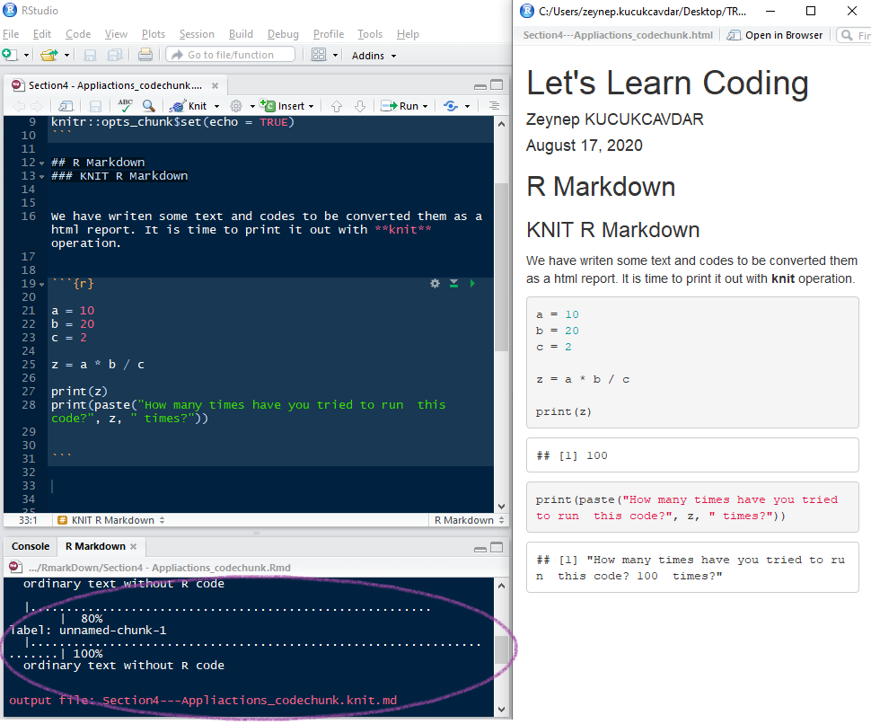

\


\


```{r setup, include=FALSE}
knitr::opts_chunk$set(echo = FALSE)
```

<center> 


</center>

<center> **In this section of the training set the aim is to give basic knowledge of Rmarkdown.** </center>


\


\


### 1. WHAT WE HAVE LEARNT 

What we have learnt so far is how to code in Base R and Dplyr in order to load and tidy the dataset, to provide some basic analysis of it by using Ggplot2.

```{r tidyverse, warning=FALSE, message=FALSE, echo=TRUE, eval=FALSE}
library(tidyverse)
```


<center>


</center>

\


\

**Let's take a challenge to remember it**

From previous lessons, we have imported the data that explains the cases and death due to the pandemy for each continent and location daily.
Now, let's glimpse into data with summarised death proportion for each location in Europe. 

```{r readcsv, warning=FALSE, message=FALSE, echo=TRUE}
library(readr)
datax = read_csv("data/coviddata.csv")
```


##### Challenge 1:

There are some codes written with missing functions and your task is to fill that blanks according to the instroductions mentioned below;

1. Select all columns to **new_deaths_per_million** from **iso_code** 
2. Then filter continent for only **Europe** and date is for only **17th August**
3. Then calculate sum of deaths and add the sum into new a column
4. Then group by Euope location
5. Then calculate death ratios for each location
6. Then order them descending

```{r dplyr, warning=FALSE, message=FALSE, echo=TRUE, eval=FALSE} 
datax %>% 
    ___________ (iso_code:new_deaths_per_million) %>%
    ___________ (continent == "Europe" & date == "2020-08-17" ) %>%
    ___________ (total=sum(total_deaths, na.rm=TRUE)) %>% 
    ___________ (location) %>% 
    ___________ (death_ratio=sum(total_deaths, na.rm=TRUE)/total) %>%
    ___________ (desc(death_ratio))
```


\


\


### 2. WHAT IS R MARKDOWN

Just think  about a report but can be enriched with codes and internal dinamycs. Just one click, after you will have new informations what you need in your reports!

R Markdown is a language for formating text and runinng procedures in a document such as presentation or html.

Sounds Great!

At first, there is a few things to do before the one click! Suprise 

<center> **Let's dive in R Markdown** </center>

<center>


</center>


You can create many types of output from a single .Rmd file. 

-  **Bookdown :** Create your own book
-  **PDF :** Write your thesis with using Latex
-  **Tufte :** Create some notes in handout        *(install.packages("tufte"))*
-  **HTML :** Provide a web site
-  **Slide/Slidly :** Make some slides to be presented online 
-  **Dashboard :** Summarise the important KPI or report your target monthly


Further information please check the link : [R Studio Website](https://rmarkdown.rstudio.com/)

\


\


### 3. WHAT IS NEXT : Dive It

#### 3.1. Install R Markdown

R Markdown package can be installed as shown below;
```{r rmarkdown, warning=FALSE, message=FALSE, eval=FALSE, echo=TRUE}
install.packages("rmarkdown")
```


\


\


#### 3.2. Create R Markdown

Next step after receiving the package is to create a new RMD documents in our R project which has been generated at first section of this training.


<center>


</center>


<center>

</center>


<center>

</center>

> **!! You have fun with [R Markdown Cheatsheet](https://rstudio.com/wp-content/uploads/2015/02/rmarkdown-cheatsheet.pdf)**


\


\


#### 3.3. Write Headers

Use ' # ' to write a headers in your text. The more ' # ' you write, the smaller headers you get.

```{r headers, warning=FALSE, message=FALSE, echo=TRUE, eval=FALSE} 

# R Markdown 

## R Markdown  

### R Markdown 

#### R Markdown  

##### R Markdown  

###### R Markdown  
  
```

<center>

</center>

<center> **Go to the console** </center>


\


\


#### 3.4. Add Lists

Use ' * ' and ' - ' to write a list

**Tidyverse Packages**

```{r list1, warning=FALSE, message=FALSE, echo=TRUE, eval=FALSE} 

* readr
* stringr
* tidyr
* dplyr
* ggplot2
* rmarkdown 
  
```


<center>

</center>

<center> **Go to the console** </center>


Also you can add some sublist too.

**Tidyverse Packages**
  
```{r list2, warning=FALSE, message=FALSE, echo=TRUE, eval=FALSE} 

* Reading Data
    - readr

* Manipulating
    - stringr
    - tidyr

* Analysis
    - dplyr

* Visualising
    - ggplot2
  
* Reporting
    - rmarkdown
  
```


<center>

</center>

<center> **Go to the console** </center>


\


\


#### 3.5. Format Text

##### 3.5.1. Bold, Italics, Strikethrough

If you check the **cheatsheet** for _formatting_ you will find many short ~~instructions~~

```{r format, warning=FALSE, message=FALSE, echo=TRUE, eval=FALSE} 

**cheatsheet**
_formatting_
~~instructions~~
  
```

<center>


</center>

<center> **Go to the console** </center>


\


\


##### 3.5.2. Font Colors

What is your favourite colour? Red or Green? It is time to show in R Markdown!

I like typing in <span style="color:red;">red</span>

or no I changed my mind it is just  <span style="color:green;">green</span>

or maybe <span style="color:blue;">blue</span>


```{r color, warning=FALSE, message=FALSE, echo=TRUE, eval=FALSE}

<span style="color:red;">red</span>
<span style="color:green;">green</span>
<span style="color:blue;">blue</span>
  
```

<center>


</center>

<center> **Go to the console** </center>


\


\

**Let's recall some of information that we have learned today**


##### Challenge 2:

Which operator is used for geting bold text ?


> A : -          
> B : **          
> C : ~~         
> D :  :bold    

\


\


#### 3.6. Add Picture

You can put some picture into your documents vie folder path as shown below

<center>

</center>

```{r picture, warning=FALSE, message=FALSE, echo=TRUE, eval=FALSE}


  
```


\


\


#### 3.7. Add Links

This is a [R Markdown Quick Tour](https://rmarkdown.rstudio.com/authoring_quick_tour.html) , you are free to visit!

You can add website link into your documents via folder path as shown below


```{r link, warning=FALSE, message=FALSE, echo=TRUE, eval=FALSE}


[R Markdown Quick Tour](https://rmarkdown.rstudio.com/authoring_quick_tour.html)

```


\


\


#### 3.8. Run Codes

You can execute some codes which might be an algoritm, visualisation or analysis as well as modify the text. To run a code in R Markdown, it is supposed to be written in a code chunk. 

```{r chunk, warning=FALSE, message=FALSE, echo=TRUE, eval=FALSE}

#```{r}

#write your code here without comment.

#```

```


<center>

</center>

<center> **Go to the console** </center>


<center>


</center>

<center> **Go to the console** </center>


\


\


#### 3.9. Design Code Chunk

You can manage code chunks in order to get some results with several options. For example if you want to run the code but not to show it, you need to modify code chunk area.
Or you can show just codes without running it and its output. 


**Hide error and warning messages**
```{r chunk2, warning=FALSE, message=FALSE, echo=TRUE, eval=FALSE}

#```{r, warning=FALSE, message=FALSE}

#write your code here without comment.

#```

```

**Not display code, only results**
```{r chunk3, warning=FALSE, message=FALSE, echo=TRUE, eval=FALSE}

#```{r, echo=FALSE}

#write your code here without comment.

#```

```

**Not run or results, only display code** 
```{r chunk4, warning=FALSE, message=FALSE, echo=TRUE, eval=FALSE}

#```{r, eval=FALSE}

#write your code here without comment.

#```

```

\


\


<center>


</center>


\


\


**It is time to challenge again, let's remember how to create a graphs from the previous lessons.**

##### Challenge 3:

We want to create a tibble table contains world map with **maps** package. But in this package for some definition of the region is supposed to be convert new one according to the location of our **datax** table. However there is a mistake in code shown below. 

Your task is to find that wrong coding and fix it.


```{r map, warning=FALSE,  message=FALSE, echo=TRUE, eval=FALSE}
library(maps)
library(ggplot2)

world_map = map_data("world") %>%  
            as_tibble() %>% 
            filter(region = case_when(region == 'UK' ~ "United Kingdom", 
                                      region == 'USA' ~ "United States",
                                      subregion == 'Hong Kong' ~ 'Hong Kong',
                                      TRUE ~ region) )

```

\


\


##### Challenge 4:

There are some codes which are mixed up. Your task is to get them ordered.

```{r map3, warning=FALSE,  message=FALSE, echo=TRUE, eval=FALSE}

1. datax_map <- 
2. summarise(death_ratio=sum(total_deaths, na.rm=TRUE)/total) %>% 
3. datax %>%
4. filter(date == "2020-08-17" & !is.na(continent) ) %>%
5. select(iso_code:new_deaths_per_million) %>%
6. mutate(total=sum(total_deaths, na.rm=TRUE)) %>%
7. group_by(iso_code, continent, location) %>%
8. arrange(desc(death_ratio))

```


\


\


##### Challenge 5:

Now, we have two tables called **datax_map** and **world_map**. **datax_map** has death ratio for each location and 'world_map' has all region and it's coordinates of world map. Your task is to get these two tables together by location or region.

```{r map5, warning=FALSE, message=FALSE, echo=TRUE, eval=FALSE}

datax_worldmap <- left_join(______, world_map, by=c("_____" = "region"))

```


#### 3.10. Knit R Markdown

We have writen some text and codes to be converted them as a html report or pdf. It is time to print it out with **knit** operation. You can find the output document saved in the working directory or project environment. 


<center>

</center>
<center> **Go to the console** </center>

<center>


</center>
<center> **Go to the console** </center>


\


\


**Let's try print a world map and knit it**

What we have had so far is that summarise of coronavirus death ratio for each location and their coordinates in the wordlmap. 
Let's look at a worldwide map with these statistics


```{r map7, warning=FALSE, message=FALSE, echo=TRUE,  eval=FALSE}
ggplot() + 
      geom_polygon(world_map, mapping=aes(x=long, y=lat, group=group), fill="lightgray") +
      geom_polygon(datax_worldmap, mapping = aes(x=long, y=lat, group=group, fill=death_ratio)) +
      scale_fill_viridis_c()+
      theme_minimal() + 
      labs( x=NULL, y=NULL, fill = "Death Ratio %", title= " Coronavirus Death Worldwide by Region") +
      theme(plot.title = element_text(size=15, hjust=0.5))

```


\


\


```{r map8, warning=FALSE, message=FALSE, echo=FALSE, eval=TRUE}
library(maps)
library(dplyr)
library(ggplot2)

world_map <- map_data("world") %>%  
             as_tibble() %>% 
             mutate(region = case_when(region == 'UK' ~ "United Kingdom", 
                                       region == 'USA' ~ "United States",
                                       subregion == 'Hong Kong' ~ 'Hong Kong',
                                       TRUE ~ region) )

datax_map <- datax %>%  
             select(iso_code:new_deaths_per_million) %>%  
             filter(date == "2020-08-17" & !is.na(continent) ) %>% 
             mutate(total=sum(total_deaths, na.rm=TRUE)) %>% 
             group_by(iso_code, continent, location) %>% 
             summarise(death_ratio=sum(total_deaths, na.rm=TRUE)/total) %>% 
             arrange(desc(death_ratio)) 

datax_worldmap <- left_join(datax_map, world_map, by=c("location" = "region"))

ggplot() + 
      geom_polygon(world_map, mapping=aes(x=long, y=lat, group=group), fill="lightgray") +
      geom_polygon(datax_worldmap, mapping = aes(x=long, y=lat, group=group, fill=death_ratio)) +
      scale_fill_viridis_c()+
      theme_minimal() + 
      labs( x=NULL, y=NULL, fill = "Death Ratio %", title= " Coronavirus Death Worldwide by Region") +
      theme(plot.title = element_text(size=15, hjust=0.5),
            axis.text.x=element_blank(),
            axis.text.y=element_blank())

```


\


\


### 4. SOLLUTIONS

##### Challenge 1:

```{r, warning=FALSE, message=FALSE, echo=TRUE}
library(dplyr)
datax %>%
  select(iso_code:new_deaths_per_million) %>%
  filter(continent == "Europe" & date == "2020-08-17" ) %>%
  mutate(total=sum(total_deaths, na.rm=TRUE)) %>%
  group_by(location) %>%
  summarise(death_ratio=sum(total_deaths, na.rm=TRUE)/total) %>%
  arrange(desc(death_ratio))
```


\


\


##### Challenge 2:

> B : ** 


\


\


##### Challenge 3:

```{r map2, warning=FALSE,  message=FALSE, echo=TRUE}
library(maps)
library(ggplot2)

world_map <- map_data("world") %>%  
             as_tibble() %>% 
             mutate(region = case_when(region == 'UK' ~ "United Kingdom", 
                                       region == 'USA' ~ "United States",
                                       subregion == 'Hong Kong' ~ 'Hong Kong',
                                       TRUE ~ region) )

```


\


\


##### Challenge 4:

> The order is : 1, 3, 5, 4, 6, 7, 2, 8

```{r map4, warning=FALSE, message=FALSE, echo=TRUE}

datax_map <- datax %>%  
             select(iso_code:new_deaths_per_million) %>%  
             filter(date == "2020-08-17" & !is.na(continent) ) %>% 
             mutate(total=sum(total_deaths, na.rm=TRUE)) %>% 
             group_by(iso_code, continent, location) %>% 
             summarise(death_ratio=sum(total_deaths, na.rm=TRUE)/total) %>% 
             arrange(desc(death_ratio)) 

```


\


\


##### Challenge 5:

```{r map6, warning=FALSE, message=FALSE, echo=TRUE}

datax_worldmap <- left_join(datax_map, world_map, by=c("location" = "region"))

```


\


\


### 5. REFERENCES

https://ourworldindata.org/coronavirus-source-data

https://bookdown.org/yihui/rmarkdown-cookbook/document-elements.html

https://rmarkdown.rstudio.com/authoring_quick_tour.html

https://www.w3schools.com/

https://bookdown.org/yihui/rmarkdown/

https://bookdown.org/


